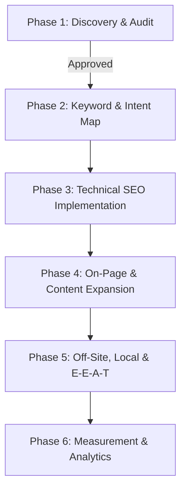

# ClipCart (https://clipcart.bd) — Technical SEO & Content Audit
**Date:** October 3, 2026  
**Auditor:** Senior Technical SEO Engineer & Content Strategist  
**Git Branch:** `seo/master-pass`  
**Status:** Phase 1 Complete (Discovery & Audit) — Awaiting User Approval for Implementation

---

## 1. Executive Summary & Stack Discovery

ClipCart is an emerging two-sided short-form video clipping and distribution marketplace targeting Bangladesh (Dhaka-heavy). It connects video creators, podcasters, and brands with skilled local clippers (editors) who cut long-form content into vertical reels (TikTok, Instagram Reels, YouTube Shorts, Facebook Reels) and earn CPM-based payouts (৳50 minimum cashout via bKash).

### Architecture & Technology Stack
| Component | Detected Implementation | SEO Implications |
| :--- | :--- | :--- |
| **Framework** | Next.js 16.3.4 (App Router), React 19.2.8 | Supports SSR and SSG; fast TTFB, but requires correct Server Component boundaries for metadata and structured data. |
| **Styling** | Tailwind CSS v4 | Lightweight utility CSS; minimal stylesheet weight (~12KB gzipped). |
| **Rendering Mode** | Statically Prerendered (`○`) with client-side hydration | Most public pages are marked `'use client'`, causing metadata export omission and client-only data fetching. |
| **i18n Approach** | Pure client React state (`LanguageProvider`) via `localStorage` | **English version is 100% invisible to search engines**. Googlebot only indexes default Bangla SSR state; no `/en` or `/bn` URLs exist. |
| **Hosting Context** | Production at `https://clipcart.bd` (Vercel/Node 24) | High baseline server response (TTFB ~10ms locally). |
| **Font Architecture** | Render-blocking `<link rel="stylesheet">` to Google Fonts | Blocks FCP/LCP; requests 4 families and 8 remote `.woff2` files from `fonts.gstatic.com` (~200KB). |

### Current Baseline Metrics (Lighthouse Mobile — Emulated 4G)
- **Performance:** `72 / 100` (FCP: 4.0s, LCP: 4.5s, CLS: 0, TBT: 130ms, Speed Index: 5.1s)
- **Accessibility:** `96 / 100`
- **Best Practices:** `96 / 100`
- **SEO Score:** `100 / 100` *(Note: Synthetic score based on basic layout tags; does not reflect missing inner page titles, missing sitemap, or unindexed English pages)*

---

## 2. Prioritized SEO Issues

### 🔴 CRITICAL SEVERITY (Immediate Indexing Blockers & Penalty Risks)

#### Issue C1: 100% Duplicate Titles & Meta Descriptions Across All Inner Pages
- **Evidence:** Inspection of prerendered HTML (`.next/server/app/*.html`) shows every single inner page (`/campaigns`, `/how-it-works`, `/for-clippers`, `/for-clients`, `/faq`, `/contact`) renders the identical root layout title and description:
  - **Title:** `ClipCart — Bangladesh Content Clipping & Distribution Marketplace`
  - **Description:** `Connect long-form video creators, podcasters, and brands with skilled short-form video clippers in Bangladesh. Flexible campaigns from ৳1,000 for 3 days. Minimum payout ৳50 via bKash and Nagad.`
- **Root Cause:** All inner pages are defined as `'use client'` components without exporting a `generateMetadata()` function or static `metadata` object.
- **Proposed Fix:** Convert top-level page files into Server Components that export unique, keyword-rich, language-accurate `metadata` objects (Title ≤60 chars, Description ≤155 chars) while passing client functionality to nested Client Components.
- **Effort:** Medium (1-2 days) | **Expected Impact:** Very High (remedies sitewide title cannibalization and snippet truncation).

#### Issue C2: Complete Crawl Invisibility for English Content (State-Only i18n)
- **Evidence:** Language switching relies exclusively on `localStorage.getItem('clipcart_lang')` inside `lib/i18n/context.tsx`. Navigating between English and Bangla does not change the URL path, query, or server headers.
- **Root Cause:** Googlebot crawls pages statelessly without interacting with client-side UI toggles. Because the default SSR state is Bangla (`bn`), search engines only ever see the Bangla DOM. The English version of the entire marketplace is completely unindexable.
- **Proposed Fix:** Implement crawlable URL routes (e.g. `/` for Bangla default and `/en/...` for English, or `/bn/...` and `/en/...`), with reciprocal `<link rel="alternate" hreflang="bn-BD" href="...">`, `hreflang="en-BD"`, and `hreflang="x-default"`.
- **Effort:** High (requires user routing approval) | **Expected Impact:** Massive (unlocks English search volume in Bangladesh for agencies, foreign founders, and English-speaking creators).

#### Issue C3: Missing `robots.txt` & Indexing Leak on Private Admin/Dashboard Routes
- **Evidence:** `GET /robots.txt` returns HTTP `404 Not Found`. Neither `public/robots.txt` nor `app/robots.ts` exists. Furthermore, `app/admin/layout.tsx`, `app/dashboard/layout.tsx`, `/login`, and `/register` have no `robots: { index: false, follow: false }` headers, inheriting `index: true, follow: true` from the root layout.
- **Root Cause:** Next.js metadata defaults to indexable if unspecified.
- **Proposed Fix:**
  1. Create a dynamic `app/robots.ts` disallowing `/admin/`, `/dashboard/`, `/api/`, and private endpoints.
  2. Add explicit `noindex, nofollow` metadata to admin and user dashboard layouts.
- **Effort:** Low (1 hour) | **Expected Impact:** High (prevents crawl budget waste and avoids indexing sensitive or empty administrative dashboards).

#### Issue C4: Missing `sitemap.xml`
- **Evidence:** `GET /sitemap.xml` returns HTTP `404 Not Found`.
- **Root Cause:** No `app/sitemap.ts` or static XML generator is implemented.
- **Proposed Fix:** Create `app/sitemap.ts` implementing Next.js `MetadataRoute.Sitemap`, dynamically generating all public routes (`/`, `/campaigns`, `/how-it-works`, `/for-clippers`, `/for-clients`, `/faq`, `/contact`), campaign dynamic slugs (`/campaigns/[id]`), language alternates (`bn` and `en`), and accurate `lastModified` timestamps.
- **Effort:** Low (2 hours) | **Expected Impact:** High (ensures comprehensive crawl discovery and fast indexing of new campaigns).

---

### 🟠 HIGH SEVERITY (Rankings, CTR, & Rich Results Deficits)

#### Issue H1: 0% Structured Data (Zero Schema.org JSON-LD Markup)
- **Evidence:** Sitewide AST search reveals 0 instances of `application/ld+json` across the entire codebase.
- **Root Cause:** Structured data was never wired into components.
- **Proposed Fix:**
  1. Root Layout: `Organization` schema (name: ClipCart, url: https://clipcart.bd, logo, founder, sameAs links to official Facebook, Instagram, YouTube).
  2. Root Layout: `WebSite` schema with potential sitelinks search target.
  3. `/faq`: `FAQPage` schema mapping all 6+ official questions and answers directly to visible content.
  4. Inner Pages: `BreadcrumbList` schema.
  5. Brand/Campaign pages: `Service` schema detailing video clipping & distribution packages (from ৳1,000).
- **Effort:** Medium (3-4 hours) | **Expected Impact:** High (powers rich snippets, FAQ dropdowns in SERPs, and knowledge panel entity recognition).

#### Issue H2: Thin Page & Bot-Facing Empty State on `/campaigns`
- **Evidence:** In `app/campaigns/page.tsx`, data fetching occurs in a client-side `useEffect`. Prerendered HTML outputs a bare loading state: `
লোড হচ্ছে...
`. When 0 campaigns are active, crawlers see thin or blank content.
- **Root Cause:** Client-side only data fetching without server pre-fetching.
- **Proposed Fix:** Fetch active campaigns on the server in a Server Component wrapper. When 0 campaigns are active, render a high-value educational landing page: detailed explanation of upcoming briefs, illustrative campaign economics (CPM tiers from ৳1,000), sample past campaigns, and direct conversion CTAs (Join WhatsApp Community for Clippers, Launch Campaign for Brands).
- **Effort:** Medium (4 hours) | **Expected Impact:** High (avoids thin content penalties while converting zero-state traffic).

#### Issue H3: Render-Blocking Google Fonts Degrading Mobile Core Web Vitals
- **Evidence:** Lighthouse mobile audit records First Contentful Paint at **4.0s** and Largest Contentful Paint at **4.5s**. Network traces reveal that `<link href="https://fonts.googleapis.com/css2?family=Unbounded...&family=Hind+Siliguri..." rel="stylesheet">` in `app/layout.tsx` blocks rendering while fetching 8 separate `.woff2` files (~200KB) from `fonts.gstatic.com`.
- **Root Cause:** External stylesheet link instead of Next.js native font optimization.
- **Proposed Fix:** Migrate all typography (`Unbounded`, `Space Grotesk`, `JetBrains Mono`, and `Hind Siliguri`) to `next/font/google`. Next.js will download and inline fonts locally at build time, eliminate external DNS/TLS handshakes, subset Bengali and Latin glyphs, and apply `display: swap`.
- **Effort:** Low (2 hours) | **Expected Impact:** Very High (drops FCP under 1.5s, improves mobile PageSpeed score to 90+).

#### Issue H4: Missing Open Graph Image, Twitter Large Card, Favicon & Manifest
- **Evidence:**
  - `GET /favicon.ico` returns HTTP 404.
  - `twitter:card` defaults to `summary` with no image specified.
  - `og:image` is omitted in `app/layout.tsx`.
  - Manifest (`manifest.json` or `app/manifest.ts`) is missing.
- **Root Cause:** Assets and OpenGraph tags were not created in `public/` or `app/`.
- **Proposed Fix:**
  1. Add branded SVG/ICO favicon and apple-touch-icon.
  2. Implement `app/manifest.ts` for PWA and mobile search indexing.
  3. Create branded high-resolution OpenGraph cards (1200x630px) for general site, clipper recruitment, and brand marketing. Set `twitter:card` to `summary_large_image`.
- **Effort:** Medium (3 hours) | **Expected Impact:** High (substantially elevates CTR on social shares, WhatsApp previews, and SERP favicon listings).

---

### 🟡 MEDIUM SEVERITY (On-Page, Information Architecture, & Trust)

#### Issue M1: Language Mismatch Between Root Metadata & Visible Content
- **Evidence:** In `app/layout.tsx`, `<html lang="bn">` is declared, but the default `<meta name="description">`, `<title>`, and `<meta name="keywords">` are in English, while the page body renders in Bangla ("সেরা কনটেন্ট ছড়িয়ে দিন...").
- **Root Cause:** English strings were hardcoded in root metadata while `LanguageProvider` defaults to Bangla.
- **Proposed Fix:** Align default metadata with the language of the page (Bangla metadata for `/` or `/bn`, English metadata for `/en`).
- **Effort:** Low (1 hour) | **Expected Impact:** Medium (ensures search snippets match the language of search queries).

#### Issue M2: Missing Self-Referencing Canonical Tags & `metadataBase`
- **Evidence:** No `<link rel="canonical">` is output on any page. `metadataBase` is not set in `app/layout.tsx`.
- **Proposed Fix:** Define `metadataBase: new URL('https://clipcart.bd')` and provide self-referencing canonical URLs on each page with language alternates.
- **Effort:** Low (1 hour) | **Expected Impact:** Medium (guards against duplicate content issues from URL query parameters or tracking tags).

#### Issue M3: Header UI Redundancy (Duplicated Theme/Lang Controls on Mobile)
- **Evidence:** In `components/layout/Navbar.tsx`, `<ThemeToggle />` and `<LanguageToggle />` are rendered in the mobile navbar bar (line 150) AND ALSO rendered inside the collapsible mobile drawer (line 175).
- **Proposed Fix:** Streamline mobile navbar controls so toggles appear cleanly in one intuitive location without DOM redundancy.
- **Effort:** Low (30 mins) | **Expected Impact:** Low-to-Medium (cleans DOM, enhances mobile UX).

#### Issue M4: Missing Essential E-E-A-T & Trust Pages (About, Privacy, Terms)
- **Evidence:** Pages `/about`, `/privacy`, and `/terms` do not exist. The footer contains copyright and feature stickers, but lacks links to legal terms, privacy policies, or company background.
- **Proposed Fix:**
  1. Create `/about` highlighting ClipCart's mission, team, and Dhaka operations desk.
  2. Create `/privacy` and `/terms` detailing creator data protection, submission rules, and payout policies.
  3. Wire these into the footer navigation.
- **Effort:** Medium (4 hours) | **Expected Impact:** High for Google Quality Rater / E-E-A-T evaluation.

---

### 🟢 LOW SEVERITY (Code Polish & Best Practice Maintenance)

#### Issue L1: Heading Hierarchy Jumps ($H_1 \to H_4$)
- **Evidence:** On `/campaigns`, `/for-clippers`, `/faq`, content skips directly from $H_1$ or $H_2$ to $H_4$ ("প্ল্যাটফর্ম" in footer).
- **Proposed Fix:** Adjust footer headings to `
` or `
` with styling classes, or structure intermediate $H_2/H_3$ headings logically.
- **Effort:** Low (1 hour) | **Expected Impact:** Low (cleaner accessibility and semantic tree).

#### Issue L2: Deprecated Next.js Middleware Naming
- **Evidence:** Next.js build emits warning: `The "middleware" file convention is deprecated. Please use "proxy" instead.`
- **Proposed Fix:** Plan non-breaking migration when stable.

---

## 3. Needs Owner Decision (Contradictions & Architectural Decisions)

Before implementing Phase 2 through Phase 6, the following core business facts and architectural paths require owner confirmation:

| # | Topic | Detected Site Contradiction / Decision Needed | Current State in Code | Recommended Path | Owner Confirmation |
| :- | :--- | :--- | :--- | :--- | :--- |
| **D1** | **Payout Channels: bKash vs. Nagad** | Meta description & marketing copy list both bKash and Nagad as payout channels. However, `app/(auth)/register/page.tsx` and `app/dashboard/withdrawals/page.tsx` explicitly disable Nagad with: *"Nagad is currently not available. Please send the ৳50 verification fee via bKash."* and *"Nagad is currently unavailable for cashouts."* | **Contradiction:** Public copy advertises Nagad; application code blocks Nagad. | **Recommend:** Update all public marketing, FAQ, and SEO metadata to state **bKash** exclusively until Nagad is live and tested. Avoids user frustration and compliance flags. | `[ ] Await Owner Input` |
| **D2** | **Campaign Zero-State Strategy** | When the database contains 0 active campaigns, `/campaigns` risks being flagged as thin or empty content by crawlers. | Currently renders an empty state on client; crawlers see "লোড হচ্ছে...". | **Recommend:** Render a rich static educational hub explaining campaign types, past distributions, CPM economics, and clear CTAs. Keep indexed as an educational marketplace page. | `[ ] Await Owner Input` |
| **D3** | **i18n URL Routing Architecture** | English content is currently invisible to search engines because language toggle is client-side only. Search engines need distinct crawlable URLs. | Single URL for both languages (`https://clipcart.bd/`). | **Recommend:** Subpath routing: Default `/` serves Bangla (`bn-BD`), `/en/...` serves English (`en-BD`), with reciprocal `hreflang` tags and `x-default`. Language switcher will navigate to the matching localized URL. | `[ ] Await Owner Input` |
| **D4** | **Brand Inquiry Primary CTA** | Brand inquiries flow to WhatsApp (`+8801337142248`) or `/client-request`. | Mixed usage across header, hero, and `/contact`. | **Recommend:** Primary CTA: Direct WhatsApp consultation (`+8801337142248`); Secondary CTA: On-site brief form at `/client-request`. | `[ ] Await Owner Input` |

---

## 4. Phase-by-Phase Implementation Roadmap

### Detailed Phase Breakdown:
- **Phase 2: Keyword & Intent Research**
  - Save `/docs/seo/keyword-map.md`.
  - Research and map high-intent queries across Clipper/Earner intent (ভিডিও এডিটিং করে ইনকাম, short video clipping job BD), Brand/Creator intent (short-form video marketing Bangladesh, reels distribution Dhaka), and Informational intent.
  - Map target keywords to unique owning URLs to prevent cannibalization.
- **Phase 3: Technical Implementation (on branch `seo/master-pass`)**
  - Implement dynamic `app/robots.ts` and `app/sitemap.ts`.
  - Setup subpath routing or approved i18n URL strategy with reciprocal `hreflang`.
  - Migrate typography to `next/font/google`.
  - Add Schema.org JSON-LD structured data (`Organization`, `WebSite`, `FAQPage`, `BreadcrumbList`, `Service`).
  - Add branded favicon, manifest, OpenGraph images, and `summary_large_image` Twitter cards.
  - Fix mobile navbar toggle duplication.
- **Phase 4: On-Page & Content Strategy**
  - Optimize headings and metadata for all key pages.
  - Expand thin pages (`/how-it-works`, `/for-clippers`, `/for-clients`, `/faq`).
  - Create `/about`, `/privacy`, `/terms` trust pages.
  - Produce `/docs/seo/content-plan.md` (20-article roadmap) and draft the top 5 high-impact E-E-A-T articles.
- **Phase 5: Off-Site & Local SEO**
  - Formulate Bangladesh-specific local optimization plan: Google Business Profile, local creator communities, startup directories, YouTube/TikTok channel SEO, and white-hat outreach.
- **Phase 6: Measurement & Roadmap**
  - Wire GSC and GA4 events (`register_click`, `whatsapp_click`, `campaign_calculator_use`, `signup_complete`).
  - Deliver `/docs/seo/measurement.md` and `/docs/seo/roadmap-30-60-90.md`.
  - Compile final walkthrough artifact with before/after benchmarks.
