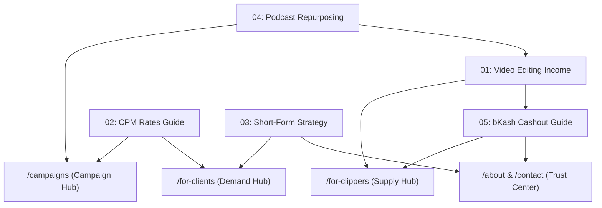

# 20-Article Content Strategy & Editorial Roadmap
## ClipCart Bangladesh (`https://clipcart.bd`)
**Target Geo:** Bangladesh (Dhaka, Chittagong, Sylhet, Rajshahi, Khulna)  
**Target Languages:** Bangla (`bn-BD` primary), English (`en-BD` secondary), and natural Banglish query targeting.  
**Audience Segments:**
1. **Supply Side (Clippers / Video Editors):** Bangladeshi youth, freelance editors, students, and mobile creators seeking accessible digital income without international payment hurdles.
2. **Demand Side (Brands, Founders, Podcasters):** Local consumer brands, D2C startups, podcast hosts, and executives wanting performance-driven short-form distribution.

---

## Executive Strategy & Topic Clustering

| Cluster | Funnel Stage | Target Audience | Primary Focus | Content Volume |
| :--- | :--- | :--- | :--- | :--- |
| **Clipper Monetization & Guides** | ToFU / MoFU | Freelance Editors, Students | Skills, software, earnings potential, bKash payouts | 8 Articles |
| **Brand Growth & Video Marketing** | ToFU / MoFU / BoFU | Founders, CMOs, Marketing Leads | Organic reach, CPM economics, influencer alternatives | 7 Articles |
| **Platform Trust, Audits & Navigational** | BoFU | Both Clippers & Brands | Verification, anti-bot audits, fee transparency, payment proof | 5 Articles |

---

## The 20 Strategic Article Blueprints

### Article 01: ভিডিও এডিটিং করে অনলাইন থেকে আয় — নতুনদের জন্য সম্পূর্ণ গাইড (২০২৬)
- **ID:** `01-video-editing-income-bangladesh`
- **Language / URL Slug:** `bn` -> `/blog/video-editing-income-bangladesh` | `en` -> `/en/blog/video-editing-income-bangladesh`
- **Funnel Stage:** ToFU (Top of Funnel — High Organic Discovery)
- **Primary Persona:** Aspiring video editor / Bangladeshi student seeking online earnings.
- **Target Keywords:**
  - *Primary:* ভিডিও এডিটিং করে আয় (MSV: 3,600)
  - *Secondary:* video editing income in bangladesh (MSV: 1,800), মোবাইল দিয়ে ভিডিও এডিটিং করে টাকা আয়, how to earn money video editing bangladesh
- **Search Intent:** Informational & Commercial Investigation. The searcher has basic editing skills (CapCut/Premiere) and wants a realistic roadmap to earn money in BDT.
- **Core Outline:**
  - **H1:** ভিডিও এডিটিং করে অনলাইন থেকে আয় — নতুনদের জন্য সম্পূর্ণ গাইড (২০২৬)
  - **H2:** ১. কেন ২০২৬ সালে ভিডিও এডিটিং সবচেয়ে ডিমান্ডিং স্কিল?
    - ইউটিউব ও সোশ্যাল মিডিয়া কনটেন্টের বিস্ফোরণ
    - লং-ফর্ম বনাম শর্ট-ফর্ম কনটেন্টের চাহিদা
  - **H2:** ২. আয় করার ৪টি প্রধান উপায় (ফ্রিল্যান্সিং, লোকাল ক্লায়েন্ট, ইউটিউব, কনটেন্ট ক্লিপিং)
    - ঐতিহ্যবাহী ফ্রিল্যান্সিং মার্কেটপ্লেস (Upwork, Fiverr) বনাম ক্লিপিং মার্কেটপ্লেস (ClipCart)
  - **H2:** ৩. ক্লিপিং করে আয়: কেন এটি নতুনদের জন্য সবচেয়ে দ্রুততম পথ?
    - ক্লায়েন্ট খোঁজার ঝামেলা নেই; সরাসরি ক্যাম্পেইন পাওয়া যায়
    - ০% প্ল্যাটফর্ম ফি এবং সর্বনিম্ন ৳৫০ ক্যাশআউট
  - **H2:** ৪. মোবাইল বনাম পিসি: প্রয়োজনীয় সফটওয়্যার ও টুলস (CapCut, Premiere Pro)
  - **H2:** ৫. পেমেন্ট পাওয়ার উপায়: বিকাশ ওয়ালেটে সরাসরি উইথড্রয়াল
  - **H2:** ৬. নতুনদের যেসব ভুল এড়িয়ে চলা উচিত (কপিরাইট, ফেক ভিউ, খারাপ হুক)
- **Internal Links:**
  - Anchor: *ক্লিপার হিসেবে জয়েন করুন* -> `/for-clippers`
  - Anchor: *চলমান ক্যাম্পেইন ব্রিফ* -> `/campaigns`
  - Anchor: *বিকাশে ক্যাশআউট গাইড* -> `05-bkash-cashout-guide-for-clippers`
- **Target Word Count:** 1,800 – 2,200 words.

---

### Article 02: বাংলাদেশে টিকটক ও রিলস ভিউয়ের CPM রেট কত? (২০২৬ গাইড)
- **ID:** `02-cpm-rates-bangladesh-tiktok-reels-shorts`
- **Funnel Stage:** MoFU (Mid of Funnel — High Relevance & Commercial Evaluation)
- **Primary Persona:** Both clippers calculating potential earnings and brand managers budgeting campaigns.
- **Target Keywords:**
  - *Primary:* tiktok cpm bangladesh (MSV: 1,900)
  - *Secondary:* reels view payment bangladesh, youtube shorts cpm bangladesh, টিকটক ভিউ থেকে আয়
- **Search Intent:** Informational with strong commercial intent. Clear breakdown of what platforms actually pay vs. what performance distribution houses pay.
- **Core Outline:**
  - **H1:** বাংলাদেশে টিকটক, রিলস ও ইউটিউব শর্টস ভিউয়ের CPM রেট কত? (২০২৬ আপডেট)
  - **H2:** ১. CPM কী এবং কীভাবে এটি হিসাব করা হয়?
    - Cost Per Mille (প্রতি ১,০০০ ভিউয়ের মূল্য) ব্যাখ্যা
  - **H2:** ২. বিভিন্ন প্ল্যাটফর্মের অফিসিয়াল CPM বনাম ক্লিপকার্ট স্পনসরড রেট
    - প্ল্যাটফর্ম তুলনা সারণী (টিকটক ফান্ড, মেটা বোনাস, ইউটিউব অ্যাডসেন্স, ক্লিপকার্ট পারফরম্যান্স ডিস্ট্রিবিউশন)
  - **H2:** ৩. ক্লিপকার্টে প্রতি ১,০০০ ভিউয়ে কত টাকা পাওয়া যায়? (৳৫০ – ৳১২০ রেট ব্যাখ্যা)
  - **H2:** ৪. কোন ধরনের কনটেন্টে সবচেয়ে বেশি ভিউ ও CPM পাওয়া যায়? (পডকাস্ট, ফিনটেক, শিক্ষণীয়, লাইফস্টাইল)
  - **H2:** ৫. ভিউ ভেরিফিকেশন ও অডিট: অর্গানিক ভিউ কীভাবে পরিমাপ করা হয়
  - **H2:** ৬. ক্যাম্পেইন ক্যালকুলেটর: ১০,০০০ থেকে ১ লক্ষ ভিউয়ে সম্ভাব্য আয়
- **Internal Links:**
  - Anchor: *ক্লিপকার্ট ক্যাম্পেইন তালিকা* -> `/campaigns`
  - Anchor: *ব্র্যান্ড ক্যাম্পেইন রেট ও প্যাকেজ* -> `/for-clients`
  - Anchor: *ভিউ অডিট সিস্টেম* -> `10-bot-views-detection-view-audit-standards`
- **Target Word Count:** 1,600 – 2,000 words.

---

### Article 03: বাংলাদেশে ব্র্যান্ড ও স্টার্টআপের জন্য শর্ট-ফর্ম ভিডিও মার্কেটিং স্ট্র্যাটেজি
- **ID:** `03-short-form-video-marketing-guide-bangladesh`
- **Funnel Stage:** ToFU / MoFU (Demand Generation — Brand / Business Persona)
- **Primary Persona:** Startup founders, D2C owners, digital marketing managers in Dhaka.
- **Target Keywords:**
  - *Primary:* short form video marketing bangladesh (MSV: 880)
  - *Secondary:* tiktok marketing agency dhaka, reels marketing for brands, কন্টেন্ট ডিস্ট্রিবিউশন বাংলাদেশ
- **Search Intent:** Educational & Solution-seeking. Why traditional single-influencer sponsorships fail and why multi-creator decentralized distribution wins.
- **Core Outline:**
  - **H1:** বাংলাদেশে ব্র্যান্ড ও স্টার্টআপের জন্য শর্ট-ফর্ম ভিডিও মার্কেটিং স্ট্র্যাটেজি (২০২৬)
  - **H2:** ১. বাংলাদেশে ভোক্তাদের মনোযোগ পরিবর্তনের চিত্র (ইউটিউব লং-ফর্ম থেকে টিকটক/রিলস)
  - **H2:** ২. ঐতিহ্যবাহী ইনফ্লুয়েন্সার মার্কেটিং বনাম ডিসেন্ট্রালাইজড ক্লিপিং নেটওয়ার্ক
    - ফিক্সড ফি ইনফ্লুয়েন্সারদের কমে যাওয়া অর্গানিক রিচ বনাম পারফরম্যান্স-ভিত্তিক ভিউ
  - **H2:** ৩. ক্লিপকার্ট মডেল: ব্র্যান্ডের ১ ঘণ্টার ভিডিও থেকে ৫০টি ভাইরাল অ্যাসেট
  - **H2:** ৪. বাজেট অপ্টিমাইজেশন: ৳১,০০০ মাইক্রো-ক্যাম্পেইন দিয়ে ট্রায়াল শুরু করার পদ্ধতি
  - **H2:** ৫. ব্র্যান্ড সেফটি ও কোয়ালিটি নিশ্চিত করার ৩টি উপায়
  - **H2:** ৬. কেস স্টাডি: ফিউচারমেকার্স (FutureMakers) ক্যাম্পেইন কীভাবে হাজারো ভিউ ছড়িয়ে দিয়েছে
- **Internal Links:**
  - Anchor: *ব্র্যান্ড ইনটেক ফরম* -> `/client-request`
  - Anchor: *ডিস্ট্রিবিউশন মডেল বিস্তারিত* -> `/for-clients`
  - Anchor: *অফিসিয়াল হোয়াটসঅ্যাপ কনসালটেশন* -> `https://wa.me/8801337142248`
- **Target Word Count:** 2,000 – 2,500 words.

---

### Article 04: লং-ফর্ম পডকাস্ট থেকে ভাইরাল শর্ট ক্লিপ বানানোর নিয়ম ও ট্রিকস
- **ID:** `04-podcast-repurposing-guide`
- **Funnel Stage:** MoFU (Creator & Editor Persona)
- **Primary Persona:** Podcast hosts wanting more visibility and clippers wanting higher view counts.
- **Target Keywords:**
  - *Primary:* podcast repurposing bangladesh (MSV: 590)
  - *Secondary:* পডকাস্ট ক্লিপ কাটার নিয়ম, how to make viral shorts from podcasts, কাইনেটিক ক্যাপশন এডিটিং
- **Search Intent:** Tactical "How-to" guide. Finding hooks, pacing vertical video, audio ducking, kinetic typography.
- **Core Outline:**
  - **H1:** লং-ফর্ম পডকাস্ট থেকে ভাইরাল শর্ট ক্লিপ বানানোর পরীক্ষিত নিয়ম ও ট্রিকস
  - **H2:** ১. কেন পডকাস্টের জন্য শর্ট-ফর্ম ক্লিপিং আবশ্যক?
  - **H2:** ২. গোল্ডেন হুক রুল: প্রথম ৩ সেকেন্ডে অডিয়েন্স ধরে রাখার সাইকোলজি
  - **H2:** ৩. ৬০ মিনিটের ভিডিও থেকে সেরা ৩টি ক্লিপ চিহ্নিত করার চেকলিস্ট
  - **H2:** ৪. ভিজ্যুয়াল ফ্রেম ও এডিটিং স্ট্যান্ডার্ড (৯:১৬ রেশিও, ডাইনামিক জুম, বি-রোল)
  - **H2:** ৫. বাংলা কাইনেটিক সাবটাইটেল ও ফন্ট সিলেকশন (হিন্দ শিলিগুড়ি, কালপুরুষ)
  - **H2:** ৬. প্ল্যাটফর্ম অপ্টিমাইজেশন: টিকটক বনাম ইনস্টাগ্রাম রিলস বনাম ইউটিউব শর্টস
- **Internal Links:**
  - Anchor: *চলমান পডকাস্ট ব্রিফ দেখুন* -> `/campaigns`
  - Anchor: *ক্লিপার গাইডলাইন* -> `/for-clippers`
  - Anchor: *বাংলা ফন্ট গাইড* -> `09-kinetic-subtitles-bangla-font-guide`
- **Target Word Count:** 1,800 – 2,200 words.

---

### Article 05: ক্লিপকার্ট থেকে বিকাশে টাকা উত্তোলনের সহজ উপায় ও TrxID অডিট
- **ID:** `05-bkash-cashout-guide-for-clippers`
- **Funnel Stage:** BoFU (High Platform Trust & Operational Clarity)
- **Primary Persona:** Active or newly signed up clippers wanting to understand payout mechanics.
- **Target Keywords:**
  - *Primary:* bkash cashout clipcart (MSV: 720)
  - *Secondary:* ক্লিপকার্ট পেমেন্ট প্রুফ, clipcart withdrawal rules, minimum cashout bkash
- **Search Intent:** Transactional & Navigational trust. Step-by-step instructions on minimum balance, moderation review, payout timeline, and TrxID verification.
- **Core Outline:**
  - **H1:** ক্লিপকার্ট থেকে বিকাশে টাকা উত্তোলনের সম্পূর্ণ নিয়ম ও TrxID অডিট গাইড
  - **H2:** ১. ক্লিপকার্টের পেমেন্ট ফিলোসফি: ০% ফি এবং সর্বনিম্ন ৳৫০ ক্যাশআউট
  - **H2:** ২. উইথড্রয়াল করার ৪টি সহজ ধাপ (ড্যাশবোর্ড টু বিকাশ ওয়ালেট)
  - **H2:** ৩. ভিউ অডিট থেকে লেজার ক্রেডিট: কত সময় লাগে?
  - **H2:** ৪. TrxID কী এবং কীভাবে নিজের পেমেন্ট ট্র্যাক করবেন?
  - **H2:** ৫. সাধারণ সমস্যা ও সমাধান (ভুল বিকাশ নম্বর, পেন্ডিং স্ট্যাটাস, রিজেকশন কারণ)
  - **H2:** ৬. ক্লিপকার্ট সাপোর্ট ডেস্কে যোগাযোগের নিয়ম
- **Internal Links:**
  - Anchor: *ক্লিপার ড্যাশবোর্ড* -> `/dashboard/withdrawals`
  - Anchor: *সচরাচর জিজ্ঞাসা (FAQ)* -> `/faq`
  - Anchor: *যোগাযোগ ও সাপোর্ট ডেস্ক* -> `/contact`
- **Target Word Count:** 1,500 – 1,800 words.

---

### Article 06: আপওয়ার্ক-ফাইভার বনাম ক্লিপকার্ট: বাংলাদেশি ভিডিও এডিটরদের জন্য কোনটি সেরা?
- **ID:** `06-clipcart-vs-upwork-fiverr-video-editors`
- **Funnel Stage:** MoFU / BoFU (Platform Comparison)
- **Primary Keywords:** upwork vs fiverr bangladesh, video editor freelance payment, ক্লিপকার্ট বনাম ফাইভার
- **Outline Highlights:** Comparison matrix: Bid connection costs, client acquisition lead times, PayPal/Payoneer withdrawal barriers vs. direct bKash, zero fee vs 20% platform cut.
- **Internal Links:** `/for-clippers`, `/register`, `01-video-editing-income-bangladesh`.

### Article 07: মাত্র ১,০০০ টাকায় সোশ্যাল মিডিয়া ক্যাম্পেইন: বাংলাদেশি ছোট ব্যবসার জন্য মাইক্রো-মার্কেটিং
- **ID:** `07-micro-campaigns-for-bangladeshi-startups`
- **Funnel Stage:** BoFU (Brand Acquisition)
- **Primary Keywords:** micro campaign bangladesh, 1000 taka advertising bd, ছোট ব্যবসার ভিডিও মার্কেটিং
- **Outline Highlights:** Why ৳1,000 for 3 days is the ultimate low-risk marketing test in BD. Expected CPM view delivery, targeting vertical feeds, converting impressions to orders.
- **Internal Links:** `/client-request`, `/for-clients`, `03-short-form-video-marketing-guide-bangladesh`.

### Article 08: মোবাইল ও পিসিতে ক্লিপ কাটার সহজ পদ্ধতি — CapCut ও Premiere Pro গাইড
- **ID:** `08-capcut-premiere-pro-mobile-clipping-workflow`
- **Funnel Stage:** ToFU / MoFU (Skill Development)
- **Primary Keywords:** capcut video editing guide bangla, premiere pro shorts workflow, মোবাইলে ভিডিও এডিটিং
- **Outline Highlights:** Step-by-step presets, vertical aspect ratio settings (1080x1920), 60fps export presets, auto-caption generation with manual Bangla spelling corrections.
- **Internal Links:** `/for-clippers`, `04-podcast-repurposing-guide`.

### Article 09: শর্ট ভিডিওতে আকর্ষণীয় বাংলা ফন্ট ও কাইনেটিক সাবটাইটেল ব্যবহারের নিয়ম
- **ID:** `09-kinetic-subtitles-bangla-font-guide`
- **Funnel Stage:** ToFU / MoFU (Creative Tactical)
- **Primary Keywords:** best bangla font for video editing, kinetic typography bangla, বাংলা সাবটাইটেল ফন্ট
- **Outline Highlights:** Comparison of Hind Siliguri, Kalpurush, Anek Bangla, Li Ador; subtitle color psychology (yellow/white with 100% black stroke); readability on mobile screens.
- **Internal Links:** `/for-clippers`, `08-capcut-premiere-pro-mobile-clipping-workflow`.

### Article 10: সোশ্যাল মিডিয়ায় ফেক ভিউ ও বট ট্রাফিক কীভাবে চেনা যায়? ক্লিপকার্টের হিউম্যান অডিট সিস্টেম
- **ID:** `10-bot-views-detection-view-audit-standards`
- **Funnel Stage:** MoFU / BoFU (Authority & Brand Safety)
- **Primary Keywords:** detect bot views tiktok, fake view checker, ক্লিপকার্ট ভিউ অডিট নিয়ম
- **Outline Highlights:** How click-farms operate; metric red flags (100k views with 2 comments and 0 shares); ClipCart's two-tier automated AI URL pre-filtering + human moderator auditing.
- **Internal Links:** `/how-it-works`, `/terms`, `02-cpm-rates-bangladesh-tiktok-reels-shorts`.

### Article 11: বাংলাদেশে ইউটিউব শর্টস থেকে আয়ের বাস্তবতা ও ক্লিপিংয়ের সুযোগ
- **ID:** `11-youtube-shorts-monetization-bangladesh`
- **Funnel Stage:** ToFU / MoFU (Clipper Monetization)
- **Primary Keywords:** youtube shorts monetization bangladesh, ইউটিউব শর্টস থেকে আয়, shorts cpm bd
- **Outline Highlights:** YouTube Shorts AdSense reality in Bangladesh (৳৫–৳১৫ CPM due to low RPM) vs. ClipCart sponsored campaign CPM (৳৫০–৳১২০ BDT). Why clipping brand campaigns yields 5x-10x higher revenue.
- **Internal Links:** `/for-clippers`, `/campaigns`, `02-cpm-rates-bangladesh-tiktok-reels-shorts`.

### Article 12: ঢাকায় কনজিউমার ব্র্যান্ডের জন্য টিকটক মার্কেটিং: সফল হওয়ার নিয়ম
- **ID:** `12-tiktok-marketing-dhaka-consumer-brands`
- **Funnel Stage:** MoFU / BoFU (Brand Strategy)
- **Primary Keywords:** tiktok marketing agency bangladesh, টিকটক মার্কেটিং স্ট্র্যাটেজি, d2c marketing dhaka
- **Outline Highlights:** Consumer demographics in Bangladesh on TikTok; fashion, gadgets, food, and education niches; how decentralized clippers create diverse angles that outperform single brand videos.
- **Internal Links:** `/for-clients`, `/client-request`, `03-short-form-video-marketing-guide-bangladesh`.

### Article 13: ৬০ মিনিটের ইন্টারভিউ থেকে ৩টি ভাইরাল হুক খুঁজে বের করার সাইকোলজি
- **ID:** `13-how-clippers-find-viral-hooks`
- **Funnel Stage:** MoFU (Clipper Skill Enhancement)
- **Primary Keywords:** viral hooks for reels, কিভাবে ভাইরাল ক্লিপ বানাবেন, video hook ideas
- **Outline Highlights:** The 3-second attention filter; curiosity hooks, contrarian hooks, emotional hooks; avoiding spoilers while driving retention to 80%+.
- **Internal Links:** `/how-it-works`, `/for-clippers`, `04-podcast-repurposing-guide`.

### Article 14: ক্লিপকার্টে ৫০ টাকা ভেরিফিケーション ফি কেন নেওয়া হয়? স্প্যাম-মুক্ত মার্কেটপ্লেসের পেছনের গল্প
- **ID:** `14-50-taka-verification-fee-explained`
- **Funnel Stage:** BoFU (Trust & Conversion Unblocker)
- **Primary Keywords:** clipcart 50 taka fee, ক্লিপকার্ট রেজিস্ট্রেশন ফি, clipcart scam or real
- **Outline Highlights:** Transparent rationale: preventing automated bot registrations, ensuring genuine editors apply, protecting client campaign budgets. Clarifying 0% ongoing fees and instant ৳50 min cashouts.
- **Internal Links:** `/register`, `/faq`, `/about`.

### Article 15: বাংলাদেশি ফাউন্ডার ও উদ্যোক্তাদের জন্য পার্সোনাল ব্র্যান্ডিং গাইড
- **ID:** `15-founder-personal-branding-reels-bangladesh`
- **Funnel Stage:** MoFU / BoFU (High-Ticket Brand Acquisition)
- **Primary Keywords:** personal branding bangladesh, founder video marketing, উদ্যোক্তাদের ব্র্যান্ডিং
- **Outline Highlights:** Why consumers trust people over logos; converting webinars, podcast appearances, and keynotes into short LinkedIn and Reels clips that build authority and attract inbound deals.
- **Internal Links:** `/for-clients`, `/client-request`, `03-short-form-video-marketing-guide-bangladesh`.

### Article 16: কেস স্টাডি: অর্গানিক ক্লিপিং ক্যাম্পেইনের মাধ্যমে কীভাবে ১ লক্ষ ভিউ অর্জন করা যায়
- **ID:** `16-futuremakers-case-study-organic-views`
- **Funnel Stage:** BoFU (Proof of Work & Conversion)
- **Primary Keywords:** clipcart case study, viral campaign bangladesh, অর্গানিক ভিউ বৃদ্ধি
- **Outline Highlights:** Breakdown of the FutureMakers campaign; raw interview footage input; 15 clipper submissions; metric performance across TikTok and Reels; CPM cost efficiency vs Facebook Paid Ads.
- **Internal Links:** `/campaigns`, `/client-request`, `/for-clients`.

### Article 17: ইনস্টাগ্রাম রিলস অ্যালগরিদম ২০২৬: বাংলাদেশি অডিয়েন্সের রিচ বাড়ানোর উপায়
- **ID:** `17-instagram-reels-algorithm-bangladesh-2026`
- **Funnel Stage:** ToFU / MoFU (Optimization & Technical SEO)
- **Primary Keywords:** instagram reels algorithm bangladesh, রিলস ভাইরাল করার উপায়, reels reach trick bd
- **Outline Highlights:** Completion rate, re-watch rate, share-to-DM velocity; best posting times for Dhaka audience (8 PM – 11 PM); audio selection and original audio optimization.
- **Internal Links:** `/for-clippers`, `13-how-clippers-find-viral-hooks`.

### Article 18: বাংলাদেশে পেপাল ছাড়া ফ্রিল্যান্সিং পেমেন্ট গ্রহণের উপায়: কেন বিকাশই সেরা
- **ID:** `18-video-editing-freelancing-payment-methods-bd`
- **Funnel Stage:** MoFU (Financial Education & Pain Point Resolution)
- **Primary Keywords:** freelancing payment without paypal bd, bkash freelancing earnings, পেপাল ছাড়া অনলাইন আয়
- **Outline Highlights:** The ongoing barrier of PayPal absence in Bangladesh; currency conversion losses via SWIFT and intermediary banks; why domestic BDT micro-payments via bKash empower grassroots creators.
- **Internal Links:** `/for-clippers`, `/faq`, `05-bkash-cashout-guide-for-clippers`.

### Article 19: ই-কমার্স ব্র্যান্ডের জন্য প্রোডাক্ট ভিডিও ও রিভিউ ক্লিপিং স্ট্র্যাটেজি
- **ID:** `19-e-commerce-product-video-clipping-strategy`
- **Funnel Stage:** MoFU / BoFU (Commercial E-Commerce Client Persona)
- **Primary Keywords:** ecommerce video ads bangladesh, দারাজ প্রোডাক্ট ভিডিও এডিটিং, product review clipping
- **Outline Highlights:** Turning unboxing and review streams into high-converting vertical TikTok clips with clear product purchase triggers; reducing CPA compared to Meta Boosts.
- **Internal Links:** `/for-clients`, `/client-request`, `07-micro-campaigns-for-bangladeshi-startups`.

### Article 20: ক্লিপকার্ট কি সত্যি টাকা দেয়? প্ল্যাটফর্ম রিভিউ, বিকাশ পেমেন্ট প্রুফ ও কাজের নিয়ম
- **ID:** `20-clipcart-platform-review-is-it-legit`
- **Funnel Stage:** BoFU (Navigational Trust & Objection Killer)
- **Primary Keywords:** clipcart review, ক্লিপকার্ট কি সত্যি টাকা দেয়, clipcart payment proof, clipcart bd real or fake
- **Outline Highlights:** Direct, honest answers to skepticism; explanation of the business model (where the money comes from: real brands and podcasters); audited bKash TrxID system; clipper testimonials.
- **Internal Links:** `/register`, `/campaigns`, `/about`, `/contact`.

---

## Publishing Calendar & Interlinking Web

---

## Content Production Guidelines
1. **Tone of Voice:** Authoritative, direct, encouraging, and radically transparent. No hype or "get rich quick" promises.
2. **Visual Proof:** Every article must include clear tables, callout boxes for guidelines, and links to live verified tools.
3. **Bangla Typography:** Strict adherence to readable Bengali typography (`Hind Siliguri`, `Kalpurush`), avoiding spelling distortions.
4. **Schema Integration:** Every published article should implement `Article` and `FAQPage` schema markup.
