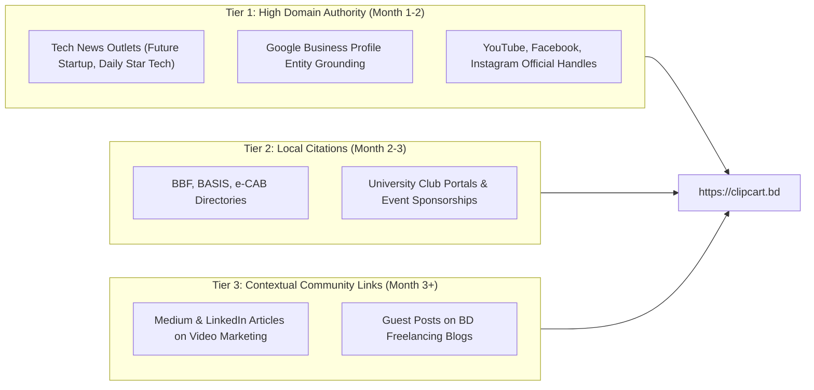

# Phase 5: Off-Site, Local SEO & E-E-A-T Strategy
## ClipCart Bangladesh (`https://clipcart.bd`)
**Market:** Bangladesh (Dhaka hub, nationwide service area)  
**Primary Language:** Bengali (`bn-BD`) & English (`en-BD`)  
**Target Entities:** ClipCart, ClipCart BD, ক্লিপকার্ট, FutureMakers

---

## 1. Strategic Context & Goal
Search engines (specifically Google and Bing in South Asia) place massive algorithmic weight on **E-E-A-T (Experience, Expertise, Authoritativeness, and Trustworthiness)** for two-sided financial/monetization platforms. Because ClipCart involves real financial transactions (bKash creator payouts, ৳50 signup fees, brand advertising spend), the website falls under the **YMYL (Your Money Your Life)** quality rater guidelines.

To rank #1 for high-intent keywords like `ভিডিও এডিটিং করে আয়`, `tiktok marketing agency dhaka`, and `কন্টেন্ট ক্লিপিং`, on-page technical fixes must be paired with external entity grounding across the Bangladeshi web.

---

## 2. Google Business Profile (GBP) Optimization Blueprint

Even though ClipCart operates digitally nationwide, establishing a verified Google Business Profile anchored in Dhaka dramatically accelerates:
- The Google Knowledge Graph entity recognition for "ClipCart" and "ClipCart BD".
- Map Pack rankings for geo-targeted searches like "video editing agency dhaka" and "influencer marketing dhaka".
- Trustworthiness signals for first-time clippers and enterprise brand inquiries.

### Recommended GBP Data Schema
- **Business Name:** ClipCart — Content Clipping & Video Marketing
- **Primary Category:** Marketing Agency
- **Secondary Categories:**
  - Video Production Service
  - Advertising Agency
  - Internet Marketing Service
- **Service Area:** Bangladesh (Specific hubs: Dhaka, Chittagong, Sylhet, Rajshahi, Khulna)
- **Primary Phone:** `+880 1337-142248` (Official WhatsApp Hotline)
- **Website URL:** `https://clipcart.bd/?utm_source=gbp&utm_medium=organic&utm_campaign=local`
- **Appointment / Intake Link:** `https://clipcart.bd/client-request?utm_source=gbp&utm_medium=organic`
- **Short Business Description (English):**
  > ClipCart is Bangladesh’s first performance-driven content clipping marketplace and short-form video distribution agency. We connect podcast hosts, brands, and startups with vetted video editors across Bangladesh to distribute viral clips across TikTok, Instagram Reels, and YouTube Shorts with verified bKash payouts.
- **Short Business Description (Bangla):**
  > ক্লিপকার্ট (ClipCart) বাংলাদেশের প্রথম পারফরম্যান্স-ভিত্তিক কনটেন্ট ক্লিপিং মার্কেটপ্লেস ও শর্ট ভিডিও ডিস্ট্রিবিউশন প্ল্যাটফর্ম। আমরা পডকাস্টার ও ব্র্যান্ডগুলোর সাথে দক্ষ ভিডিও এডিটরদের সংযুক্ত করে টিকটক, রিলস ও শর্টসে অর্গানিক রিচ ও নিশ্চিত বিকাশ পেআউট প্রদান করি।

### Review Generation & Reputation Protocol
1. **Post-Cashout Review Trigger:** When a clipper's withdrawal is successfully disbursed with a TrxID, display a prompt: *"উপার্জন পেয়ে খুশি? গুগলে আপনার অভিজ্ঞতা শেয়ার করুন!"* linking directly to the GBP review short-link (`https://g.page/r/.../review`).
2. **Review Response Standard:** ClipCart operations will respond to 100% of reviews within 24 hours in both Bengali and English, reinforcing brand keywords (e.g., "ধন্যবাদ আপনার মূল্যবান মতামতের জন্য! ক্লিপকার্ট থেকে নিয়মিত বিকাশ পেআউট পেতে আমাদের সাথেই থাকুন।").

---

## 3. Local Citations & Entity Footprint (NAP Consistency)

Google corroborates entity validity by cross-referencing NAP (Name, Address, Phone) consistency across respected local web assets.

### Priority Bangladeshi Business Directories
| Platform | Target URL / Section | Anchor / Entity Data | Priority |
| :--- | :--- | :--- | :--- |
| **Bangladesh Brand Forum (BBF)** | Agencies / Digital Directory | ClipCart BD — Content Distribution | Tier 1 |
| **BASIS (Bangladesh Association of Software and Information Services)** | Member/Affiliate Submissions | Digital Marketing & Creative Tech | Tier 1 |
| **e-CAB (e-Commerce Association of Bangladesh)** | Partner Directory | Marketing & Creator Economy Partner | Tier 1 |
| **BizDorkar / Bangladesh Yellow Pages** | Business Listing | ClipCart (Dhaka, Bangladesh) | Tier 2 |
| **Crunchbase** | Company Profile | ClipCart BD (Creator Economy / AdTech) | Tier 1 |
| **Product Hunt** | Global Launch Profile | ClipCart — TikTok & Shorts Distribution | Tier 2 |

---

## 4. Cross-Platform Video & Social SEO

Because ClipCart specializes in vertical video, our own social footprints must be optimized for search algorithms on YouTube, TikTok, and Meta.

### A) YouTube Channel SEO (`@clipcartbd`)
- **Channel Handle:** `@clipcartbd` (URL: `https://www.youtube.com/@clipcartbd`)
- **Channel Title:** `ClipCart BD — কনটেন্ট ক্লিপিং ও ভিডিও এডিটিং`
- **Channel Keywords / Tags:** `ClipCart`, `ClipCart BD`, `ক্লিপকার্ট`, `ভিডিও এডিটিং করে আয়`, `পডকাস্ট ক্লিপিং`, `TikTok clipping Bangladesh`, `FutureMakers`, `CapCut editing bangla`.
- **Default Description Template:**
  ```text
  ক্লিপকার্ট (ClipCart) বাংলাদেশের প্রথম শর্ট-ফর্ম কনটেন্ট ডিস্ট্রিবিউশন প্ল্যাটফর্ম।
  ভিডিও এডিটিং করে আয় করুন এবং সরাসরি বিকাশে পেমেন্ট বুঝে নিন (সর্বনিম্ন ৳৫০)।

  🌐 ওয়েবসাইট: https://clipcart.bd
  🚀 চলমান ক্যাম্পেইন: https://clipcart.bd/campaigns
  💬 অফিশিয়াল হোয়াটসঅ্যাপ হটলাইন: https://wa.me/8801337142248
  👥 ক্রিয়েটর কমিউনিটি: https://chat.whatsapp.com/LUK6WkzD9KZ2fpuZgy0pan
  ```
- **Playlists Strategy:**
  1. *ভিডিও এডিটিং মাস্টারক্লাস ও টিপস (CapCut & Premiere)*
  2. *পডকাস্ট রিপারপাসিং ও ভাইরাল হুক সিক্রেটস*
  3. *ক্লিপকার্ট ক্যাম্পেইন আপডেট ও লিডারবোর্ড শোকেস*

### B) TikTok & Instagram Profile Optimization
- **TikTok Bio:**
  > 🎬 Bangladesh's #1 Content Clipping Marketplace  
  > ✂️ Edit clips. Earn per 1,000 views.  
  > 💸 ৳50 Min Cashout via bKash • 0% Fee  
  > 👇 Join active campaigns:  
  > `clipcart.bd/for-clippers`
- **Instagram Bio:**
  > 🚀 Performance Short-Form Video Distribution for Brands & Podcasters  
  > 🇧🇩 Dhaka Operations Desk  
  > 💰 ৳50 bKash Payouts for Editors  
  > 🔗 `clipcart.bd`

### C) Facebook Community & Page (`@clipcartbd1`)
- **Page Name:** `ClipCart — Content Distribution Marketplace`
- **Action Button:** "Send WhatsApp Message" -> `+8801337142248`
- **Pinned Announcement Post:** Visual infographic explaining the 4-step distribution loop, bKash ৳50 minimum cashout, and link to `/campaigns`.

---

## 5. Community Outreach & Grassroots Editor Acquisition

To build a reliable supply of 500+ active video editors within Dhaka and nationwide universities:

### University Media & Film Club Partnerships
1. **Target Campuses:**
   - North South University (NSU Media & Film Club, NSU Communications Club)
   - BRAC University (BRACU Film Club)
   - Independent University, Bangladesh (IUB Media Club)
   - American International University-Bangladesh (AIUB Photography & Media Club)
   - Dhaka University (DU Film Society)
2. **Outreach Activation:**
   - Host virtual "Vertical Video Editing Sprints" with ৳১০,০০০ prize pools sponsored by brand partners.
   - Distribute physical posters and digital flyers in student Facebook groups highlighting remote skill monetization with bKash cashouts.

### Bangladeshi Video Editing Facebook Communities
- Engage legitimately (not spamming) in top communities:
  - *Video Editors of Bangladesh* (120k+ members)
  - *CapCut Video Editors Bangladesh* (85k+ members)
  - *Premiere Pro & After Effects Bangladesh* (60k+ members)
  - *Freelancers of Bangladesh* (300k+ members)
- **Content Hooks:** Share actionable tutorials (e.g. "বাংলা কাইনেটিক সাবটাইটেল কীভাবে ৫ মিনিটে CapCut-এ বানাবেন") with a footer link to active paid briefs on ClipCart.

---

## 6. Digital PR & Media Outreach Angles

High-authority contextual backlinks from Bangladeshi tech and business news outlets pass immense link equity and establish permanent E-E-A-T.

### Press Angles Tailored for Tech Journalists
1. **"The Rise of Decentralized Content Clipping in Bangladesh's Creator Economy"**
   - *Target Outlets:* The Daily Star Tech, Dhaka Tribune, TechShohor, Future Startup.
   - *Core Narrative:* How local youth are bypassing international payment hurdles through micro-payouts via bKash, and how brands are generating millions of organic views without paying six-figure influencer retainers.
2. **"FutureMakers & ClipCart Case Study: 100k+ Organic Views on Shoestring Budgets"**
   - *Target Outlets:* Startup Dhaka, Business Standard, Daily Ittefaq Tech Desk.
   - *Core Narrative:* Real data, verified view audits, and tangible business ROI for local podcasts and D2C brands.

---

## 7. Backlink Acquisition Priority Roadmap


