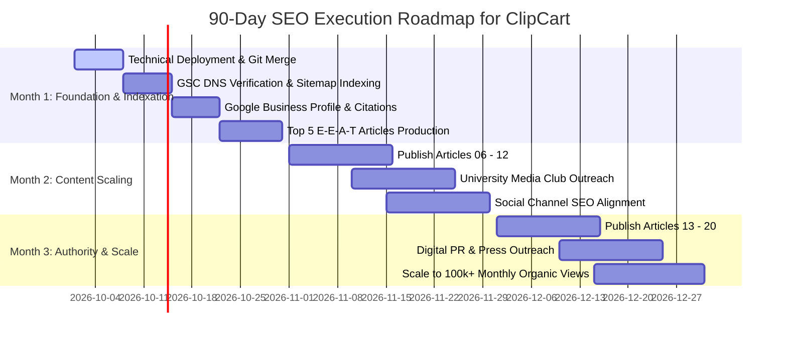

# 30 / 60 / 90-Day SEO Execution Roadmap
## ClipCart Bangladesh (`https://clipcart.bd`)
**Focus:** Search Dominance, Entity Grounding, Supply/Demand Scale  
**Owner:** ClipCart Engineering & Growth Leadership

---

## Roadmap Executive Summary

---

## Month 1 (Days 1 – 30): Technical Hygiene, Indexation & Entity Grounding

### Week 1 (Days 1 – 7): Codebase Merge & Production Verification
- [x] **Technical SEO Implementation:** Self-hosted Google Fonts via `next/font/google`, OpenGraph (1200x630) and Twitter card assets, dynamic `robots.ts` and `sitemap.ts`.
- [x] **Subpath i18n Routing:** Prerendered `/en/...` routes with reciprocal `<link rel="alternate" hreflang="...">` tags in HTML `<head>`.
- [x] **Crawl Hygiene:** `noindex, nofollow` applied to `/admin/*`, `/dashboard/*`, `/login`, and `/register`.
- [x] **Trust Pages Deployed:** `/about`, `/privacy`, `/terms`, `/en/about`, `/en/privacy`, `/en/terms` live with Schema.org Breadcrumbs.
- [ ] **Production Deploy:** Merge branch `seo/master-pass` into `main` and deploy to live hosting environment.
- [ ] **DNS Property in GSC:** Add DNS TXT record for `clipcart.bd` in Google Search Console. Submit `https://clipcart.bd/sitemap.xml`.

### Week 2 (Days 8 – 14): Core Web Vitals & Analytics Verification
- [ ] **Core Web Vitals Audit:** Run live PageSpeed Insights on production URLs. Verify LCP $< 1.8\text{s}$, CLS $< 0.05$.
- [ ] **GA4 & GTM Setup:** Verify that `gtag.js` or Google Tag Manager picks up events from `lib/seo/analytics.ts` (`register_click`, `whatsapp_click`).
- [ ] **Index Status Audit:** Monitor GSC Coverage report. Verify zero 5xx server errors and zero canonical mismatches.

### Week 3 (Days 15 – 21): Local SEO & Entity Grounding
- [ ] **Google Business Profile (GBP):** Create and verify GBP listing in Dhaka: "ClipCart — Content Clipping & Video Marketing".
- [ ] **Local Citations:** Submit business details (NAP: ClipCart, Dhaka, +8801337142248) to Bangladesh Brand Forum, BizDorkar, and BASIS/e-CAB directories.
- [ ] **Social Profiles:** Update YouTube (`@clipcartbd`), Facebook (`@clipcartbd1`), Instagram (`@clipcartbd`), and TikTok profiles with canonical website URLs and target keywords.

### Week 4 (Days 22 – 30): Top 5 E-E-A-T Articles Publication
- [ ] **Article Formatting:** Publish the top 5 drafted articles from `docs/seo/articles/` onto the website under `/blog/...`:
  1. `01-video-editing-income-bangladesh.md`
  2. `02-cpm-rates-bangladesh-tiktok-reels-shorts.md`
  3. `03-short-form-video-marketing-guide-bangladesh.md`
  4. `04-podcast-repurposing-guide.md`
  5. `05-bkash-cashout-guide-for-clippers.md`
- [ ] **Internal Linking Verification:** Check contextual links leading from articles to `/for-clippers`, `/campaigns`, `/for-clients`, and `/client-request`.

**Month 1 Success Criteria:**
- 100% of core marketing and trust URLs indexed in Google.
- GBP listing verified and visible on Google Maps in Dhaka.
- Top 5 cornerstone articles indexed.

---

## Month 2 (Days 31 – 60): Content Scaling & Community Distribution

### Week 5 – 6 (Days 31 – 45): Mid-Funnel Article Rollout
- [ ] **Publish Articles 06 – 09:**
  - `06-clipcart-vs-upwork-fiverr-video-editors`
  - `07-micro-campaigns-for-bangladeshi-startups`
  - `08-capcut-premiere-pro-mobile-clipping-workflow`
  - `09-kinetic-subtitles-bangla-font-guide`
- [ ] **Rich Snippets Check:** Validate `FAQPage` and `Article` schema in Google Rich Results Test.

### Week 7 – 8 (Days 46 – 60): Community & University Outreach
- [ ] **University Media Clubs:** Contact film and media club executives at NSU, BRACU, and IUB. Propose a "1-Minute Viral Clip Sprint" featuring a live brand partner brief.
- [ ] **Facebook Group Educational Series:** Post helpful snippets and infographics from Article 08 (CapCut Workflow) and Article 09 (Bangla Font Guide) in *Video Editors of Bangladesh* and *Freelancers of Bangladesh*.
- [ ] **Publish Articles 10 – 12:**
  - `10-bot-views-detection-view-audit-standards`
  - `11-youtube-shorts-monetization-bangladesh`
  - `12-tiktok-marketing-dhaka-consumer-brands`

**Month 2 Success Criteria:**
- Organic search impressions surpass $25,000 / \text{month}$.
- Rank inside Google Top 10 for at least 5 target keywords (e.g. `ভিডিও এডিটিং করে আয়`, `tiktok cpm bangladesh`).
- Active registered clipper pool increases by 150+ organic editors.

---

## Month 3 (Days 61 – 90): Authority Scaling & Enterprise Brand Inflow

### Week 9 – 10 (Days 61 – 75): High-Conversion & Trust Content
- [ ] **Publish Articles 13 – 16:**
  - `13-how-clippers-find-viral-hooks`
  - `14-50-taka-verification-fee-explained` (Trust and anti-spam transparency)
  - `15-founder-personal-branding-reels-bangladesh`
  - `16-futuremakers-case-study-organic-views`
- [ ] **Publish Articles 17 – 20:**
  - `17-instagram-reels-algorithm-bangladesh-2026`
  - `18-video-editing-freelancing-payment-methods-bd`
  - `19-e-commerce-product-video-clipping-strategy`
  - `20-clipcart-platform-review-is-it-legit`

### Week 11 – 12 (Days 76 – 90): Digital PR & Media Coverage
- [ ] **Tech Media Pitching:** Send press release and case study data to tech journalists at *The Daily Star*, *Dhaka Tribune*, and *Future Startup*:
  > *"How ClipCart is Empowering Bangladeshi Youth to Monetize Video Editing via bKash While Slashing Brand Ad Costs"*
- [ ] **Backlink Equity Review:** Audit incoming domain referrers. Ensure zero toxic backlinks and strong do-follow anchors.
- [ ] **Conversion Rate Optimization (CRO):** A/B test CTA button copy on `/for-clippers` and `/for-clients` based on 60 days of GA4 conversion data.

**Month 3 Success Criteria:**
- Total organic search impressions reach $100,000+ / \text{month}$.
- Rank #1–#3 for brand navigational queries (`ClipCart`, `ClipCart BD`, `ক্লিপকার্ট`).
- Organic search directly generates 40+ brand inquiries per month via WhatsApp and `/client-request`.

---

## Owner Action Items & Responsibility Matrix

| Task | Owner | Frequency | Deliverable |
| :--- | :--- | :--- | :--- |
| **GSC Index & Error Audit** | Technical Lead | Weekly | Zero crawl errors, green Core Web Vitals |
| **Blog Publishing (Articles 01–20)** | Content Strategist | 2 Articles / Week | Fully formatted markdown articles with schema |
| **WhatsApp Lead Follow-up** | Growth / Ops Desk | Daily (< 1 hour SLA) | Direct brand consultation on `+8801337142248` |
| **Clipper Payout Verification** | Ops Desk | Daily (< 24h SLA) | Prompt bKash disbursement with TrxID logs |
| **GBP Review Generation** | Ops Desk | Ongoing | 5-star review outreach to paid clippers |
